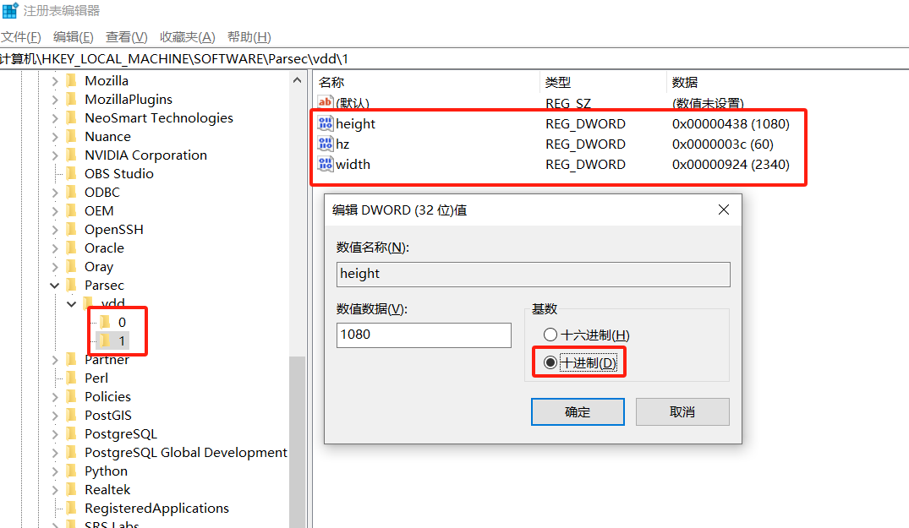

# parsec-vdd-cli 命令行程序

> 使用前请安装parsec-vdd驱动。

- [parsec-vdd-v0.38](https://builds.parsec.app/vdd/parsec-vdd-0.38.0.0.exe)
- [parsec-vdd-v0.41](https://builds.parsec.app/vdd/parsec-vdd-0.41.0.0.exe) (recommended)

## 使用
```
parsec-vdd-cli.exe [-a]
  -a add a virtual display at startup.
```
使用-a启动参数启动时将自动增加一个虚拟显示屏，当前代码虚拟显示屏上限8个。

### 可使用bat脚本启动
parsec-vdd-cli.bat
```
@echo off
parsec-vdd-cli.exe -a
```


## 关于Easy-Virtual-Display
本软件可替代Easy-Virtual-Display(evd)使用，evd为托盘程序且有弹框，不是很方便，所以这才有了这个命令行程序。

Easy-Virtual-Display程序自带的是旧版本的虚拟显示器驱动。parsec-vdd-cli兼容新旧版本驱动。无需卸载旧驱动。如需安装新驱动，下载parsec-vdd-0.41.0.0.exe，直接安装，安装会默认卸载旧版本驱动。

## 自定义分辨率
连接之前，虚拟显示器会在`HKEY_LOCAL_MACHINE\SOFTWARE\Parsec\vdd`注册表中查找其他预设分辨率。最多支持5个值。如果需要更多，需要自行修补驱动程序DLL。

```
SOFTWARE\Parsec\vdd
  key: 0 -> 5 | (width, height, hz)
```

参考图


## 成品
请访问Release页面下载

## 编译
use gcc:`gcc -o parsec-vdd-cli.exe -static parsec-vdd.cc -lsetupapi -lstdc++`

use g++:`g++ -o parsec-vdd-cli.exe -static parsec-vdd.cc -lsetupapi`

## 使命
等待[ParsecVDisplay App](https://github.com/nomi-san/parsec-vdd)的发布后，本程序预计也会随即停止更新。

## 参考

cli源码来自 https://github.com/nomi-san/parsec-vdd 

本文中Easy-Virtual-Display指的是 https://github.com/KtzeAbyss/Easy-Virtual-Display/ 